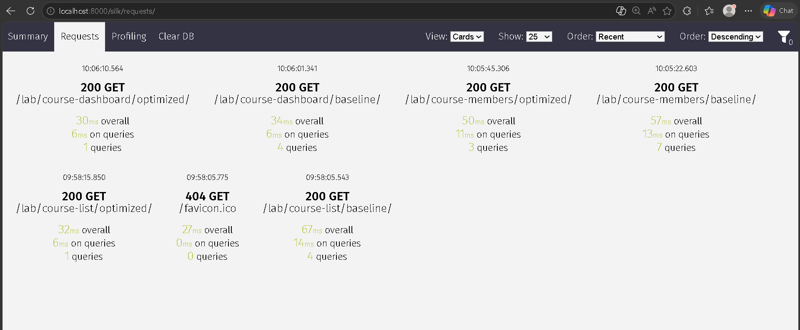

# Laporan Praktikum Modul 05 - Optimasi Database (Django)
**Nama:** Mohammad Tsaqif Akmal Al-Hammam  
**NIM:** A11.2023.14899  
**Mata Kuliah:** Pemrograman Sisi Server  
**Instansi:** Universitas Dian Nuswantoro 

---

## 1. Pendahuluan
Laporan ini disusun untuk memenuhi tugas praktikum Modul 05 mengenai optimasi database pada aplikasi *Simple LMS*. Fokus utama praktikum ini adalah melakukan profiling query menggunakan **Django Silk**, mengidentifikasi masalah *N+1 query*, serta menerapkan berbagai teknik optimasi ORM untuk meningkatkan performa aplikasi secara signifikan.

---

## 2. Tabel Perbandingan Performa (Django Silk)
Berikut adalah data hasil pengujian yang dilakukan terhadap 3 skenario endpoint (Baseline vs Optimized). Target peningkatan performa minimal 50% telah tercapai pada seluruh endpoint.

| Skenario Kasus          | Endpoint (URL)           | Baseline (Queries) | Optimized (Queries) | Efisiensi (%) | Teknik Optimasi                 |
| :-----------------------| :----------------------- | :----------------- | :------------------ | :------------ | :------------------------------ |
| **Course + Teacher**    | `/lab/course-list/`      | 4 query            | **1 query**         | **75.0%**     | `select_related`                |
| **Course + Members**    | `/lab/course-members/`   | 7 query            | **3 query**         | **57.1%**     | `prefetch_related` & `annotate` |
| **Statistik Dashboard** | `/lab/course-dashboard/` | 4 query            | **1 query**         | **75.0%**     | `aggregate`                     |

---

## 3. Analisis dan Implementasi Teknik Optimasi

### A. Penanganan N+1 Problem (Case 1)
* **Masalah:** Pada endpoint baseline, pemanggilan profil `instructor` di dalam perulangan *Course* menyebabkan Django melakukan query tambahan untuk setiap baris data.
* **Solusi:** Menerapkan `.select_related('instructor')` untuk melakukan **SQL JOIN**.
* **Hasil:** Query terpangkas drastis menjadi hanya 1 query tunggal.

### B. Optimasi Reverse Relation (Case 2)
* **Masalah:** Penghitungan jumlah murid dan materi menggunakan `.count()` di dalam loop menyebabkan beban database yang berat.
* **Solusi:** Menggunakan `.prefetch_related()` untuk mengambil data relasi secara efisien dan `.annotate(Count(...))` untuk memindahkan proses perhitungan dari Python ke mesin Database.
* **Hasil:** Performa meningkat lebih dari 50% dan menghindari query duplikat.

### C. Agregasi Statistik Global (Case 3)
* **Masalah:** Menghitung total data menggunakan loop Python sangat tidak efisien saat data berjumlah besar.
* **Solusi:** Menerapkan fungsi `.aggregate()` untuk mendapatkan hasil kalkulasi langsung dari PostgreSQL.
* **Hasil:** Sangat cepat dan hanya membutuhkan 1 query untuk seluruh statistik dashboard.

### D. Penerapan Database Indexing
Telah dilakukan penambahan index pada model `Course` untuk mempercepat proses pencarian dan pengurutan data:

```python
class Meta:
    indexes = [
        models.Index(fields=['created_at'], name='idx_course_created_at'),
        models.Index(fields=['instructor', 'created_at'], name='idx_instructor_created')
    ]
```

Hal ini memastikan pencarian berdasarkan instruktur atau waktu pembuatan tetap optimal meskipun jumlah data terus bertambah.

## 4. Lampiran Bukti Screenshot
Berikut adalah bukti visual profiling dari tab *Requests* Django Silk yang menunjukkan perbandingan jumlah query dan waktu eksekusi:



*(Catatan: Gambar diambil dari tab Requests untuk menunjukkan perbandingan baseline dan optimized secara apple-to-apple dalam satu tampilan).*

---

## 5. Kesimpulan
Seluruh tahapan optimasi pada Modul 05 telah berhasil diimplementasikan. Penggunaan teknik `select_related`, `prefetch_related`, dan agregasi terbukti mampu menekan jumlah query database hingga di atas 50%. Dengan diterapkannya *indexing*, skema database kini lebih siap untuk menangani beban data yang lebih besar (*scalable*).