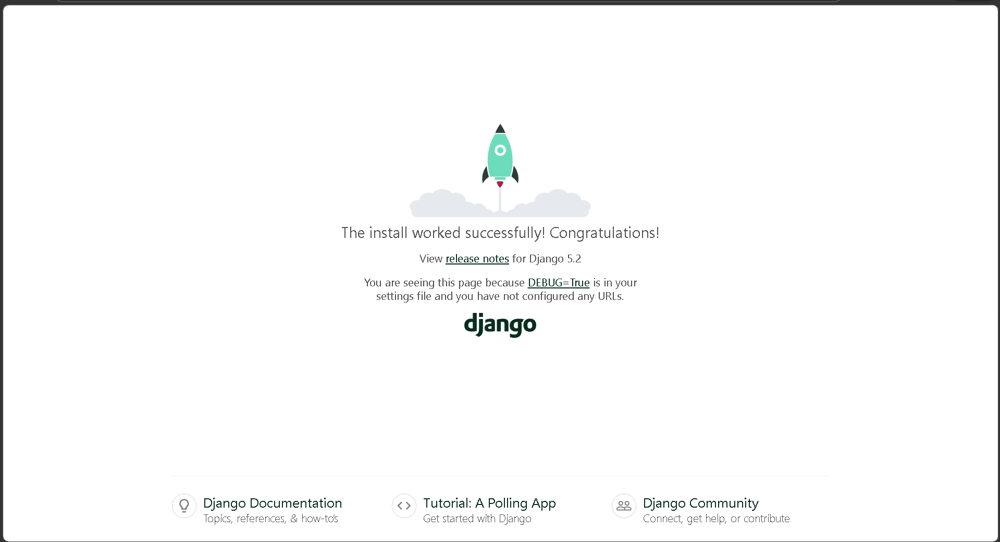

# Simple LMS - Setup Environment

Project ini adalah inisialisasi awal untuk aplikasi Simple LMS menggunakan Django dan PostgreSQL yang dijalankan di dalam container Docker. Project ini dirancang dengan struktur *best practice* untuk memenuhi kriteria tugas Pemrograman Sisi Server.

## 📦 Persyaratan Sistem
Pastikan sistem Anda sudah terinstal perangkat lunak berikut:
- Docker Desktop (pastikan dalam keadaan *running*)
- Git

## 🛠️ Penjelasan Environment Variables
Project ini menggunakan *environment variables* untuk menjaga keamanan kredensial dan konfigurasi. File `.env.example` telah disediakan di dalam *repository* sebagai referensi. Berikut adalah penjelasan untuk masing-masing variabel:

- `DEBUG`: Mengatur mode debug Django (`True` untuk *development*, `False` untuk *production*).
- `SECRET_KEY`: Kunci rahasia Django yang digunakan untuk *cryptographic signing*.
- `POSTGRES_DB`: Nama database PostgreSQL yang akan dibuat dan digunakan (contoh: `lms_db`).
- `POSTGRES_USER`: *Username* untuk mengakses database PostgreSQL.
- `POSTGRES_PASSWORD`: *Password* untuk mengakses database.
- `POSTGRES_HOST`: *Host* database (menggunakan nama *service* `database` yang terdaftar di Docker Compose).
- `POSTGRES_PORT`: *Port* yang digunakan oleh PostgreSQL (default: `5432`).

## 🚀 Cara Menjalankan Project

Ikuti langkah-langkah berikut secara berurutan untuk menjalankan project di lingkungan lokal Anda:

1. **Clone repository ini**
   Unduh *source code* ke komputer Anda dan masuk ke direktori project.
   ```bash
   git clone https://github.com/Tsaqif691/simple-lms-setup.git
   cd simple-lms
   ```

2. **Siapkan file Environment**
   Salin *template* environment yang sudah disediakan menjadi file `.env` yang akan dibaca oleh sistem.
   ```bash
   cp .env.example .env
   ```

3. **Build dan Jalankan Container**
   Jalankan perintah berikut untuk merakit *image* Docker dan menyalakan seluruh *services* (Web dan Database) di latar belakang (*background*):
   ```bash
   docker compose up -d --build
   ```

4. **Lakukan Migrasi Database**
   Jalankan perintah migrasi agar tabel-tabel bawaan Django dibuat di dalam database PostgreSQL:
   ```bash
   docker compose exec web python manage.py migrate
   ```

5. **Akses Aplikasi**
   Buka *web browser* Anda dan kunjungi alamat berikut untuk melihat halaman awal Django: 
   `http://localhost:8000`

6. **Menghentikan Aplikasi**
   Jika Anda sudah selesai mengembangkan aplikasi dan ingin mematikan *server*, gunakan perintah:
   ```bash
   docker compose down
   ```

## 📸 Screenshot Django Welcome Page
